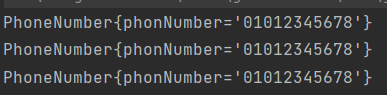

# ch1.코테

> 🔑 **코테를 보는 이유 및 코드 짜는 방법**
>
> 기능을 정확히 만드는지, 문제 해결 능력, 효율적으로 작성하는 가 등을 보기 위해
>
> 문제를 단계별로 나누고 작성하는 방법을 연습하기
>


## 1. 채용 프로세스

> 코테 → 서류 → 1차 면접 → 2차 면접
>

## 2. 코테 구성

- 문제 수 : 4~9
- 시험 시간 : 3~5 시간
- 난이도 2~4레벨

## 3. 코테 보는 이유

- 기능을 정확하고 효율적으로 만드는지 확인하기 위해
- 문제 해결 과정을 보기 위해
- 같은 결과 이지만 빠르고 효율적으로 작성했는지 확인하기 위해

## 4. 잘 짠 코드?

- 문제를 해결했는가
- 가독성이 좋은가
    - 코드의 역할에 집중해 작성함(변수, 메서드 클래스 활용해 중복 줄이기)
    - 역할에 맞게 이름 붙이기
- 효율적인 코드인가?

## 5. 코드 짤 때

- 요구 조건에 맞게 먼저 설계를 해야함
- 설계에 약하면 플젝을 자주 엎으면서 설계연습해보기
- 설계가 잘 되면 가독성과 역할에 충실한 코드를 짤 수 있음
- 문제를 단계별로 나누어서 설계 및 해결

## 6. 디버깅 및 실행착오 줄이기

1. 코드 단계별로 작성
2. 하나 단계를 작성 후 로그를 이용해 검증
3. 검증 실패하면 실패 단계에 자세히 로그 찍기

---

## 7. 직접 설계 해보기


📌  **사용자가 입력한 전화번호를 가진 사람들을 전화번호부에서 검색하는 기능 구현**

### **단계별 설계**

1. 전화번호 형식?
2. 전화번호부에 저장되어있는 사람은 어떻게 나타낼지
3. 사람과 전화번호는 어떻게 비교할지?
4. 전화번호부는 어떤 형식으로 나타낼 지
5. 전화번호 찾기

→ 단계별로 클래스나 메서드를 역할별로 나누어 작성하기

### 1. 전화번호 형식

- 010-xxxx-xxxx, 010 xxxxx xxxxx, 010xxxxxxxx 등으로 나타낼 수 있음
- 입력받은 문자에서 숫자만 남겨 일괄된 형식으로 전화번호 변환함

```java
//숫자가 아닌 문자들만 제거
phonNumber.replaceAll("[^0-9], "");

//별도의 클래스를 작성해서 전화번호를 나타내는 문자열이라는 것을 알려줄 수 있음
private static class PhoneNumber{
    public final String phonNumber;

    public PhoneNumber(String rawPhoneNumber) {
            this.phonNumber = rawPhoneNumber.replaceAll("[^0-9]", "");
    }

    @Override
    public String toSting() {
            return "phonNumber{" +
                         "phonNumber='" + phonNumber + '\'' +
                            '}';
    }
}
```

- 제대로 구성했는지 검증

```java
public static void main(String[] args) {
    System.out.println(new PhoneNumber("010-1234-5678");
    System.out.println(new PhoneNumber("010 1234 5678");
    System.out.println(new PhoneNumber("01012345678");
}
```



위의 결과

### 2. 전화번호부의 사람 나타내기

- 전화번호부에 저장되는 사람 표현
- 한 사람은 여러 개의 전화번호부를 가질 수 있음

```java
private static class Person {

    //0. 변수 선언
    // name, numbers는 값이 생성 후 변경되지 않게 final로 선언
    // List 처럼 외부에서 접근해 임의로 값을 바꿀 수 있는 경우는 private으로 선언하고,
    // 내부에서 의도한 대로만 해당 객체를 사용할 수 있게 해줌
    // final String 처럼 불변인 객체는 외부에서 읽기만 할 수 있음으로 public으로 선언해도 됨
    public final String name;
    private final List<PhoneNumber> numbers;

    public Person(String name) {
            this.name = name;
            numbers = new ArrayList<>();
    }

    //1. 전화번호 추가 메서드
    public void addPhoneNumber(PhoneNumber number) {
            numbers.add(number);
    }
		
    @Override
    public String toString() {
        return "Person{" +
                "name='" + name + '\'' +
                ", numbers=" + numbers +
                '}';
    }
}
```

검증

```java
public static void main(String[] args) {
    Person person = new Person("홍길동");
    person.addPhoneNumber(new PhoneNumber("010-1234-5678"));
    person.addPhoneNumber(new PhoneNumber("010 1234 5678"));
    person.addPhoneNumber(new PhoneNumber("01012345678"));
    System.out.println(person);
}
```


### 3. 사람과 전화번호 비교

- 사람은 Person, 전화번호는 PhoneNumber 클래스로 나타냄
- Person이 phoneNumber를 가지고 있는지 확인하기

```java
//3-1. Person class에 추가하면
public boolean hasPhoneNumber(PhoneNumber number) {
    return numbers.contains(number);
}
```

검증

```java
public static void main(String[] args) {
		Person person = new Person("홍길동");
		person.addPhoneNumber(new PhoneNumber("010-1234-5678"));
		System.out.println(person.hasPhoneNumber(new PhoneNumber("01012345678")));
}
```

결과


> ❓ **왜 false가 나오는 가?**
> 
> 1. 가장 의심 되는 부분은 새로 추가된 로직인 `numbers.contains(number)` 부분
> 2. `contains()` 는 `equals()` 를 사용해 객체를 비교하여 false가 나옴
>


> 💡 **해결 방법**
>
> - PhoneNumber 클래스에  equals() 메서드를 오버라이딩하기

```java
@Override
public boolean equals(Object obj) {
    if(!(obj instanceof PhoneNumber)) {
        return false;
    }
    return phonNumber.equals(((PhoneNumber) obj).phonNumber);
}
```


### 4. 전화번호부 나타내기

- 전화번호부는 여러 사람을 담는 용도 → 여러 개의 Person 객체를 가지고 있을 수 있음
- PhoneBook클래스를 작성하고 Person 객체를 리스트로 관리

```java
private static class PhoneBook {
		private final List<Person> people;

		private PhoneBook() {
			people = new ArrayList<>();
		}

		public void addPerson(Person person) {
			people.add(person);
		}

		@Override
    public String toString() {
        return "PhoneBook{" +
                "people=" + people +
                '}';
    }
}
```

검증

```java
public static void main(String[] args) {
		Person person1 = new Person("홍길동");
    person1.addPhoneNumber(new PhoneNumber("010-1234-5678"));
    person1.addPhoneNumber(new PhoneNumber("010-2345-6789"));
    
    Person person2 = new Person("김철수");
    person2.addPhoneNumber(new PhoneNumber("010-2345-0246"));
    
    Person person3 = new Person("이영희");
    person3.addPhoneNumber(new PhoneNumber("010-1357-9135"));

    PhoneBook phoneBook = new PhoneBook();
    phoneBook.addPerson(person1);
    phoneBook.addPerson(person2);
    phoneBook.addPerson(person3);
    
    System.out.println(phoneBook);
}
```


> ❗**변경사항**
>
> **같은 객체를 여러번 추가하면 모두 등록되어서 같은 객체는 여러 번 등록하지 않게 변경**
> - 중복 제거를 위해 PhoneBook 의 people를 Set으로 선언

```java
private static class PhoneBook {
		private final Set<Person> people;

		private PhoneBook() {
			people = new HashSet<>();
		}

		public void addPerson(Person person) {
			people.add(person);
		}

		@Override
    public String toString() {
        return "PhoneBook{" +
                "people=" + people +
                '}';
    }
}
```


### 5. 전화번호 찾기

- 전화번호로 Person을 찾는 메서드 구현

```java
public Person search(PhoneNumber number) {
    return people.stream()
            .filter(p -> p.hasPhoneNumber(number))
            .findFirst()
            .orElse(null);
}
```

검증

```java
public static void main(String[] args) {
		Person person1 = new Person("홍길동");
    person1.addPhoneNumber(new PhoneNumber("010-1234-5678"));
    person1.addPhoneNumber(new PhoneNumber("010-2345-6789"));

    Person person2 = new Person("김철수");
    person2.addPhoneNumber(new PhoneNumber("010-2345-0246"));

    Person person3 = new Person("이영희");
    person3.addPhoneNumber(new PhoneNumber("010-1357-9135"));

    PhoneBook phoneBook = new PhoneBook();
    phoneBook.addPerson(person1);
    phoneBook.addPerson(person2);
    phoneBook.addPerson(person3);

    System.out.println(phoneBook.search(new PhoneNumber("01012345678")));
    System.out.println(phoneBook.search(new PhoneNumber("010-2345-6789")));
    System.out.println(phoneBook.search(new PhoneNumber("01023450246")));
    System.out.println(phoneBook.search(new PhoneNumber("01013579135")));
    System.out.println(phoneBook.search(new PhoneNumber("01000000000")));
}
```

결과


