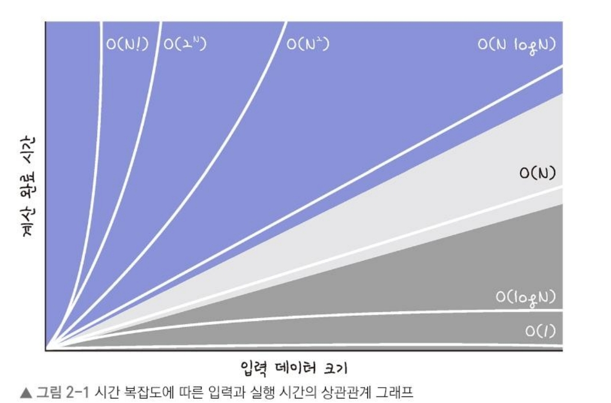

# ch2. 시간복잡도

# 코테에서의 Time Out

- 코테에서 특정 시간 미만 조건이 있음(일반적으로 1초; 1초 이상 걸리면 안됨을 의미)
- 코드의 실행 시간과 데이터의 상관관계를 `시간 복잡도`라고 함

---

# 시간 복잡도?

- 입력데이터와 실행시간의 함수 관계
- 요구하는 입력을 제한 시간 내에 해결할 수 있게 파악

## 1. 빅오(Big-O) 표기법

- 코테에서 효율성을 검사하는데 사용하는 시간 복잡도
- 알고리즘이 겪을 수 있는 최악의 경우의 시간과 입력간의 상관관계
- 입력 크기 : N 이면 $O(N)$

> ex) 길이가 N인 배열에서 하나의 원소를 치는 코드
>
>
> ```java
> private int search(int[] array, int target) {
> 	for (int i = 0; i< array.length; i++) {
> 		if(array[i] == target) {
> 			return i;
> 		}
> 	}
> 	return -1;
> }
> ```
>
> - 해당 코드에서 최악의 시간을 가지는 경우는 모든 원소를 순회한 후 원소를 찾게 되는 경우
> - $O(N)$의 시간 복잡도를 가지게 됨

## 2. 시간 복잡도 그래프

| 알고리즘 | 시간 복잡도 |
| --- | --- |
| 이진 탐색 | $O(logN)$ |
| 선형 탐색 | $O(N)$ |
| 정령 | $O(N logN)$ |
| 조합 | $O(2^N)$ |
| 순열 | $O(N!)$ |
- N이 커질 수록 시간복잡도의 결과 값의 차이가 커진다.



## 3. 입력 데이터 개수별 사용 가능한 시간 복잡도 알고리즘

- 코테에서 시간 복잡도를 따져봐야함
- ex) 제한 시간 1초라고 하면 최악의 경우의 시간 복잡도가 1억이 넘지 말아 야함(커트라인 기준이라고 생각하면됨)

> ex1) N 최대 값이 1만, 시간 복잡도가 $O(NlogN)$ 이라고 하면 최악의 경우가 13만으로 계산됨 → 통과
ex2) N 최대가 1만, 시간 복잡도가 $O(N^2)$ 라면 최악의 경우가 1억이이 됨 → 통과 못할 가능성 큼
>

- 시간 복잡도에 따른 비효율적/효율적 문제 풀이


---

# 시간 복잡도 계산하기

- 반복 횟수 세기
- 반복문이 어떤 값에 비례해서 반복하는지 확인해 계산

## 1. 어림짐작하기

- 정확한 시간 계산하는 용도 X
- → 2N, N+5, N/2 모두 N에 비례하기 때문에 $O(N)$으로
- 만약 배열이 M번 반복한다고 하면
    - $O(MN)$
- N짜리 배열 순회 후 M짜리 배열을 순회한다고 하면
    - $O(N+M)$

## 2. 시간 복잡도 줄이기

- 제한 시간이 1초일 때 유추 가능한 시간 복잡도와 알고리즘 (힌트로 사용하기)

| $N$ | 유추 가능한 시간 복잡도 | 유추 가능한 알고리즘 |
| --- | --- | --- |
| 10 | $O(N!)$ | 순열 |
| 20 | $O(2^N)$ | 조합 |
| 1,000 ~ | $O(N^3)$, $O(N^3 logN)$ | 완전 탐색, 이진 탐색 |
| 10,000 ~ | $O(NlogN)$ | 정렬, 이진 탐색 |

## 3. 여러 알고리즘 사용 시 시간 복잡도 생각하기

- 길이가 N인 배열을 이중 반복분으로 순회하는 것
    - $O(N^2)$
- 순회와 별개로 아래처럼 순회하면 추가적을 $O(N)$ 시간 발생하여
    - $O(N^2 +N)$이 됨

    ```java
    int arr = ... //길이가 N인 배열
    
    for(int v : arr) {
    	System.out.println(v);
    }
    
    for(int a : arr) {
    	for(int b : arr) {
    		System.out.println(a + b);
    	}
    }
    ```


- 계산해보기

```java
int arr = ... //길이가 N인 배열

for (int i =0; i < arr.length; i++) {
	for(int j = i + 1; j <arr.length; j++) {
		int a = arr[i];
		int b = arr[j];
		System.out.println("a=" + a + ", b=" + b);
	}
}
```

i = 0일때 N-1번,  i = 1일 때 N-2 번, ….. 으로 1부터 N-1까지의 합 → $(N-1)(N-2) /2$ 가 되고 이는

$\frac{1}{2}N^2 + \frac{3}{2}N + 1 = O(\frac{1}{2}N^2) = O(N^2)$ 로 나타낼 수 있음
